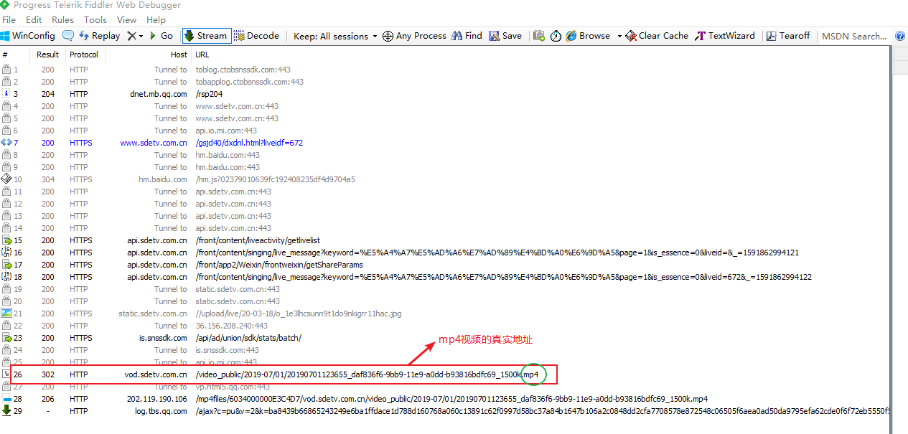
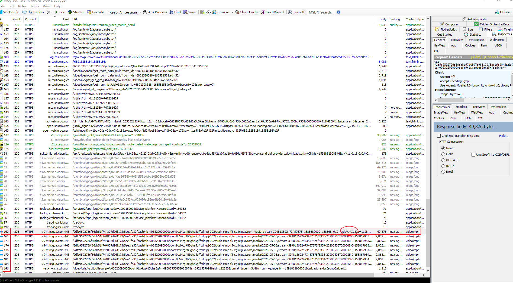
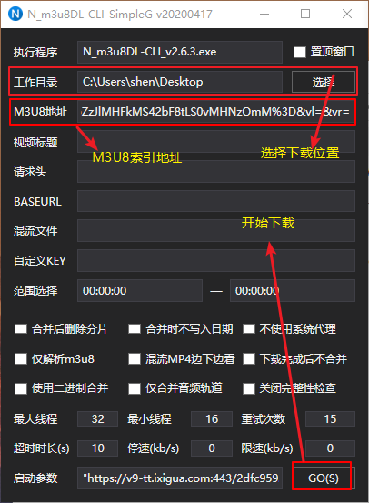
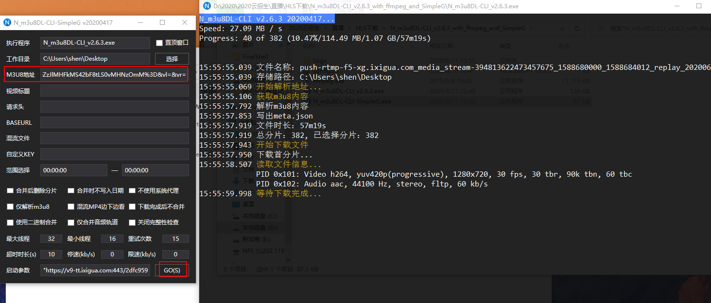

### 如何下载微信和APP的web视频？

#### 1 web视频的发展的几个阶段

##### 1.1 最开始，http + flv 阶段

通过http方式，将服务器已经转换成flv的视频下载到本地缓存，再调用本地浏览器的flv播放器播放。

由于FLV会缓存在客户端，对FLV的保密性不好。

下载方式：

下载视频，直接到浏览器缓存找flv文件即可。

##### 1.2 后来，rtmp + flv 阶段

通过rtmp协议直接连接到服务器，实时播放服务器上的flv文件。

这种方式可以任意选择视频播放点，并不会缓存完整的flv文件，所以本地缓存里找不到flv文件，保密性好。

下载方式：

这种方式的下载，就需要借助第三方视频下载工具，比如：硕鼠、秋棠等

##### 1.3 再后来，HLS + HTML5 阶段

随着主流浏览器开始禁用flash插件，依赖于浏览器的flash播放器的flv格式页页逐渐被淘汰。

苹果的m3u8取代flash，与html5结合成为网页视频的主流。

m3u8最大的优点就是可以切片，视频不再是完整的视频，而是被分成无数个ts切片，再有m3u8索引组合成完整视频。

下载方式：

依然需要借助第三方工具，you-get是其中最为出色的一个

##### 1.4 当前，移动互联网时代，APP + HLS + HTML5 阶段 

微信和APP大行其道，网页被套在微信或者APP里浏览，开发者为了保护视频不被盗用，而在视频网页上加了多种防护措施。

#### 2 突破PC调试手机中微信或者APP的页面

对于微信，主要分为三类：

##### 2.1 未做明显限制

这种页面最多，基本上就是相当于啥也没做。

**检验方法**

手机里其他浏览器也可以打开页面并正常进行页面浏览，这种页面在PC上调试只需要开Chrome的模拟器即可。

**绕过方法**

chrome的开发者工具条（Ctrl + Shift +I）右上角的手机小图标（Ctrl + Shift +M）

##### 2.2 检查UA来限制

通过UA字段，对浏览器识别，只允许微信自带的QQ浏览器访问

**检测方法**

手机浏览器打开后会跳转到开发者自己的其余页面，或者有弹窗提示，但是不会跳到open.weixin.qq.com域名去。

看着这种很可能是基于UA（UserAgent）检测了。所以破解方法很简单，模拟UA就好。chrome内置了这个功能。

**绕过方法**

开启chrome的UA模拟器即可。

设置方法参照：https://learnku.com/articles/5319/chrome-modify-user-agent-simple-simulation-of-wechats-built-in-browser

##### 2.3 利用微信oauth做限制

上面两种都是比较常见而且简单就能绕过限制的，而有些对用户身份验证要求比较高的页面，则会利用微信的OAUTH来拉取openid做验证，这种就不仅仅是改UA这么容易绕过去了。好在也不是无解。因为身份验证一般都是存在cookies里的，所以我们可以直接给PC模拟器伪造cookies来让页面误以为我们是在微信内做的验证。

**绕过方法**

参照：https://www.freebuf.com/geek/81420.html

#### 3 下载web中视频

##### 3.1 Fiddler 抓包，找出视频MP4或m3u8的链接

Fiddler 不但能截获各种浏览器发出的 HTTP 请求, 也可以截获各种智能手机发出的 HTTP/HTTPS 请求。

###### **3.1.1 下载安装Fiddler**

Fiddler 下载地址：https://www.telerik.com/download/fiddler/fiddler4

######  **3.1.2配置 Fiddler，允许“远程连接”和捕获HTTPS**

打开 Fiddler,   Tools-> Options -> connections， 选中"Allow remote computers to connect". 是允许别的机器把 HTTP/HTTPS 请求发送到 Fiddler 上来。

> a.允许远程计算机连接Fiddler

> 菜单：Tools-> Fiddler Options->Connections，勾选"Allow remote computers to connect" 
>
> 允许别的机器把 HTTP/HTTPS 请求发送到 Fiddler 上来

> b.配置可捕获HTTPS请求(***不需要捕获HTTPS，则忽略此步***) 

> 菜单：Tools-> Fiddler Options->Connections，勾选"Capture HTTPS CONNECTs"后

> 再勾选"Decrypt HTTPS traffic"、"Ignore server certificate errors"
>
> Fiddler 就可以截获 HTTPS 请求

注意：配置完后记得要重启 Fiddler ，并关闭Windos防火墙。

###### **3.1.3手机安装HTTPS证书(\*不需要捕获HTTPS，\**则忽略此步\**\*)** 

> a.首先确定Fiddler所在电脑的IP地址：例:192.168.8.8 

> b.打开被测手机浏览器，访问http://192.168.8.8:8888，点"FiddlerRoot certificate" 然后安装证书

注：Iphone、Ipad安装则很简单，点击安装即可。Android安装稍微麻烦点，则需要先设置手机锁屏密码、PIN码，安装证书时会提示，按步骤走即可。 

###### **3.1.4 手机连接本机所在同网络Wifi，设置代理**

> a.代理主机名：Fiddler所在电脑IP

> b.代理服务器端口： Fiddler使用的端口

###### **3.1.5 手机APP操作，生成和分析请求数据**

**案例1：**

网址：https://www.sdetv.com.cn/gsjd40/dxdnl.html?liveidf=672

限制策略分析：只有手机微信可以正常打开，pc端打开显示“请在微信客户端打开链接”，应该是利用微信oauth做限制。

解决办法：因为我们只想要隐藏的视频链接，并不像进行其他操作，所以无需折腾到PC访问，直接在PC上启动Fiddler，对手机的流量抓包即可。

抓包分析：

在URL一栏，直接发现mp4链接，并没有采用HLS的m3u8切片，那就简单了，直接把地址复制出来进行简单拼接，丢到迅雷下载。

**案例2：**

网址：https://m.toutiaoimg.cn/i6821328318416358156/

限制策略分析：只有手机浏览器才可以打开，PC端可以打开，但是会重定向到其他页面，应该是通过检查浏览器的UA做的限制。

解决办法：同样，只要视频链接，无需折腾到PC的UA了，直接在PC上启动Fiddler，对手机的流量抓包即可。

抓包分析：

在URL一栏，发现视频采用了HLS，红框圈出来的j即是m3u8索引文件，后面的包都是ts切片，把m3u8的索引链接复制出来进行简单拼接，就是完整的m3u8的完整链接。把这个链接交给M3U8 Downloader下载神器就可以了

##### 3.2 M3U8 Downloader下载神器

HLS （HTTP Live Streaming）是苹果公司实现的基于 HTTP 的流媒体协议，可以实现流媒体的点播和直播播放，主要用于PC和Apple终端的音视频服务。

包括一个 M3U8的索引文件、TS媒体分片文件和key加密串文件。

简而言之， M3U8是一个播放列表。如果想下载一个m3u8视频，需要把m3u8索引的所有TS切片全部下载，再合并。

合并TS切片就需要大名鼎鼎的 FFmpeg 了，而 M3U8 Downloader 则是一款基于 FFmpeg 的M3U8下载器，只需要输入 m3u8 地址，M3U8 Downloader 就会帮你把这个播放列表里的视频都下载回来，并且自动合并成一个视频文件。

M3U8 Downloader使用非常方便，只需要输入 m3u8 地址，选择需要的视频格式，比如 mp4，再选择下载路径，然后点击下载，M3U8 Downloader 就会帮你把这个播放列表里的视频都下载回来，并且自动合并成一个视频文件。

M3U8 Downloader下载地址：https://github.com/nilaoda/N_m3u8DL-CLI/releases

对案例2的m3u8索引链接进行下载

